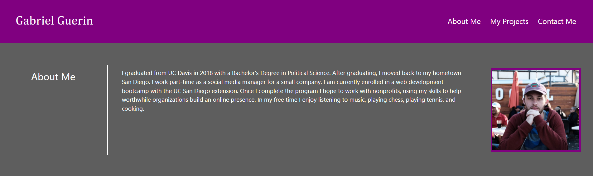

# Portfolio

## Description
This is a portfolio that I can use to advertise my services to potential employers. It is a page that can hold my contact info and some of my best deployed projects that show off my skills. I do not have any deployed projects yet, so I just used placeholder links that can be updated later. Employers expect a job candidate to have a site like this, so building it is an important step to getting a good job.

In the process of building it, I learned a lot about flexboxes and CSS in general. CSS is very powerful, and you can accomplish much with it if you know how to use it. Building this site taught me a lot about how to use CSS.

## Usage
There are several links on this page. The three links on the upper right corner of the page in the navbar (see screenshot) each go to one of the main sections of the page to make navigation easier. In the middle section, My Projects, there are five cards that will each link to a deployed project once I have some. Each card has an image that will also be updated as I link to my deployed projects. For now, they are placeholder links that go nowhere. In the Contact Me section, there are three links that each go to a different way I can be contacted.

## Credits
I recieved some assistance and advice from my classmates and from my tutor, Vinnie Lopez.

## License
Copyright (c) 2021 Gabriel Guerin

Permission is hereby granted, free of charge, to any person obtaining a copy of this software and associated documentation files (the "Software"), to deal in the Software without restriction, including without limitation the rights to use, copy, modify, merge, publish, distribute, sublicense, and/or sell copies of the Software, and to permit persons to whom the Software is furnished to do so, subject to the following conditions:

The above copyright notice and this permission notice shall be included in all copies or substantial portions of the Software.

THE SOFTWARE IS PROVIDED "AS IS", WITHOUT WARRANTY OF ANY KIND, EXPRESS OR IMPLIED, INCLUDING BUT NOT LIMITED TO THE WARRANTIES OF MERCHANTABILITY, FITNESS FOR A PARTICULAR PURPOSE AND NONINFRINGEMENT. IN NO EVENT SHALL THE AUTHORS OR COPYRIGHT HOLDERS BE LIABLE FOR ANY CLAIM, DAMAGES OR OTHER LIABILITY, WHETHER IN AN ACTION OF CONTRACT, TORT OR OTHERWISE, ARISING FROM, OUT OF OR IN CONNECTION WITH THE SOFTWARE OR THE USE OR OTHER DEALINGS IN THE SOFTWARE.
